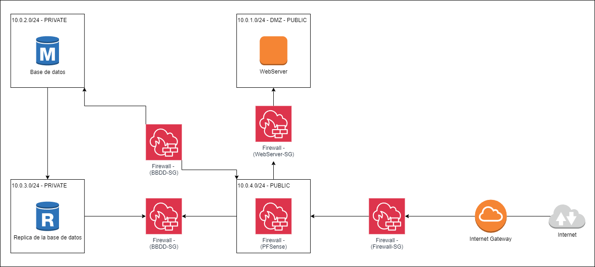
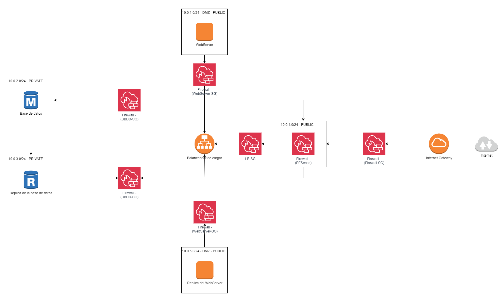

# Ciberseguridad en redes informáticas en AWS

## 1. Cimentación de la Red (VPC y Subredes)
El primer paso consistió en definir el espacio de red virtual aislado donde residirán todos los recursos.

*   **Creación de la VPC:** Se creó una VPC denominada `vpc-herzfelder` con un bloque CIDR de `10.0.0.0/16`, lo que proporciona un amplio rango de direcciones IP internas.
*   **Segmentación de la Red (Subredes):** Se dividió la VPC en tres segmentos específicos para separar las responsabilidades de seguridad:
    *   **Subred Pública:** Llamada `public-subnet` (`10.0.1.0/24`), ubicada en la zona de disponibilidad `eu-south-2a`. Se habilitó la asignación automática de IPv4 pública para que los recursos aquí desplegados (como el WebServer) sean accesibles desde Internet.
    *   **Subredes Privadas para Datos:** Se crearon dos subredes para la base de datos para permitir la replicación y alta disponibilidad:
        *   `private-subnet-BBDD-1` (`10.0.2.0/24`) en la zona `eu-south-2a`.
        *   `private-subnet-BBDD-2` (`10.0.3.0/24`) en la zona `eu-south-2b`.

## 2. Conectividad Exterior (Internet Gateway y Enrutamiento)
Para que la subred pública pueda comunicarse con el mundo exterior, se realizaron las siguientes configuraciones de red:

*   **Internet Gateway (IGW):** Se creó y adjuntó un Internet Gateway a la VPC `vpc-herzfelder`. Este componente actúa como el puente entre la red de AWS e Internet.
*   **Tablas de Enrutamiento:**
    *   Se creó una tabla de enrutamiento específica para el tráfico público.
    *   Se añadió una ruta hacia el destino `0.0.0.0/0` (todo el tráfico de Internet) apuntando al Internet Gateway creado.
    *   **Asociación:** Esta tabla se asoció explícitamente a la `public-subnet`.

## 3. Despliegue de la Capa de Computación (EC2)
Se aprovisionó el servidor que atenderá las peticiones de los usuarios.

*   **Instancia EC2 (WebServer):**
    *   **AMI:** Se seleccionó Amazon Linux 2023 (Kernel 6.1).
    *   **Tipo de Instancia:** `t3.micro` (ideal para pruebas y cargas ligeras).
    *   **Seguridad de Acceso:** Se generó un par de claves SSH llamado `webserver-keypair-herzfelder` en formato `.pem` para la administración remota segura.
    *   **Red:** Se vinculó a la `vpc-herzfelder` y se colocó dentro de la `public-subnet`.

## 4. Capa de Datos de Alta Disponibilidad (RDS)
Para la persistencia de datos, se preparó el entorno para una base de datos gestionada con réplica.

*   **Grupo de Subredes de DB:** Se creó un "DB Subnet Group" que agrupa las dos subredes privadas (`private-subnet-BBDD-1` y `2`). Esto es indispensable en RDS para permitir que la base de datos principal y su réplica residan en zonas de disponibilidad distintas, garantizando que el servicio no caiga si una zona falla.
*   **Instancias RDS:** Se desplegó una base de datos principal y una réplica de lectura, conectadas entre sí para sincronización de datos.

## 5. Configuración de Seguridad (Firewalls)
Se implementó una estrategia de "defensa en profundidad" utilizando dos capas de seguridad:

*   **Network ACL (NACL):** Se configuró una lista de control de acceso a nivel de red para filtrar el tráfico que entra y sale de las subredes.
*   **Security Groups (Firewalls de Instancia):**
    *   **WebServer-SecurityGroup:** Se configuraron reglas de entrada para permitir tráfico HTTP (80), HTTPS (443) y SSH (22).
    *   **DB Security Group:** Se aplicó el concepto de Zona Desmilitarizada (DMZ), configurando el firewall de la base de datos para que solo acepte tráfico proveniente del grupo de seguridad del WebServer, bloqueando cualquier otro acceso directo.

## 6. Acceso Remoto y Gestión de Tráfico
Finalmente, para la administración de la infraestructura:

*   **Port Forwarding:** Se estableció una estrategia de reenvío de puertos (Port Forwarding) para lograr atravesar los firewalls de forma segura y alcanzar los servicios web internos o gestionar la base de datos sin exponerla directamente a Internet.
*   **Validación:** Se confirmó la conectividad mediante las claves SSH generadas, asegurando que el flujo de tráfico entrante y saliente está correctamente orquestado por el Internet Gateway.

# Creación de AMI y Balanceador de Carga (ALB)

Este documento detalla el procedimiento seguido para preparar la infraestructura de red, crear una imagen personalizada de un servidor web y configurar el equilibrio de carga.

## 7. Configuración de la Infraestructura de Red

Antes de la duplicación de servidores, se preparó el entorno de red en la VPC:

*   **Creación de Subred:** Se creó una nueva subred denominada `DMZ-subnet2` dentro de la VPC `vpc-herzfelder`.
*   **Asignación de Zona y CIDR:** Se configuró en la zona de disponibilidad `eu-south-2b` con el bloque CIDR `10.0.5.0/24`.
*   **Configuración de Enrutamiento:** Se verificó que la tabla de rutas de la subred DMZ tuviera una ruta activa hacia el destino `0.0.0.0/0` a través de una interfaz de red (ENI) específica para permitir el tráfico externo.

## 8. Creación de la Imagen Personalizada (AMI)

Para asegurar que los nuevos servidores sean idénticos al original, se generó una Amazon Machine Image (AMI):

*   **Selección del Origen:** Se utilizó la instancia denominada `WebServer` como base.
*   **Generación de la Imagen:** Desde el menú de **Acciones > Imagen y plantillas**, se seleccionó **Crear imagen**.
*   **Detalles de la AMI:** Se le asignó el nombre `Herzfelder-WebServer-AMI` y se habilitó la opción de **Reiniciar instancia** para garantizar la coherencia de los datos durante la creación.
*   **Verificación:** Se monitoreó el estado de la AMI en la sección de Imágenes hasta que cambió de "Pendiente" a "Disponible".

## 9. Despliegue de la Segunda Instancia

Utilizando la imagen creada, se procedió a lanzar un segundo servidor:

*   **Lanzamiento desde AMI:** Se seleccionó la AMI `Herzfelder-WebServer-AMI` y se ejecutó la opción **Lanzar instancia a partir de una AMI**.
*   **Identificación:** La nueva instancia se nombró `WebServer2`.
*   **Configuración de Red y Seguridad:**
    *   Se seleccionó la VPC `vpc-herzfelder` y la subred `DMZ-subnet2`.
    *   Se habilitó la **Asignación automática de IP pública**.
    *   Se asoció el grupo de seguridad existente `WebSever-SecurityGroup`.
    *   Se utilizó el par de claves `webserver-keypair-herzfelder` para el acceso.

## 10. Configuración del Balanceador de Carga (ALB)

Finalmente, se inició la configuración del servicio para distribuir el tráfico:

*   **Navegación:** En la consola de EC2, se accedió a la sección **Equilibrio de carga > Balanceadores de carga**.
*   **Selección del Tipo:** Se eligió crear un **Application Load Balancer (ALB)**, diseñado para manejar tráfico HTTP y HTTPS a nivel de aplicación (Capa 7).
*   **Creación:** Se pulsó el botón **Crear** para iniciar el asistente de configuración del balanceador que conectará las instancias `WebServer` y `WebServer2`.

